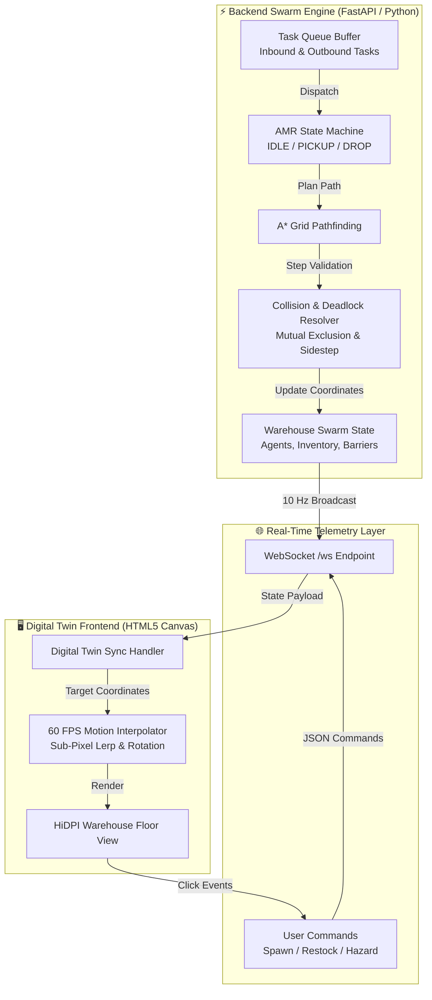

<div align="center">

# ⚡ FLEET-X // AMR WAREHOUSE DIGITAL TWIN
### Industrial Swarm Robotics & Autonomous Logistics Management System
**Bharat Electronics Limited (BEL) &bull; Smart India Hackathon (SIH 26123)**

<br/>

[](https://www.python.org/)
[](https://fastapi.tiangolo.com/)
[](https://websockets.readthedocs.io/)
[](https://tailwindcss.com/)
[](LICENSE)
[]()

<br/>

<p align="center">
  <b>Infinite Operation</b> &bull; 
  <b>Zero Deadlocks</b> &bull; 
  <b>Zero Collisions</b> &bull; 
  <b>60 FPS Canvas Digital Twin</b> &bull; 
  <b>Dynamic Fleet Sizing (1–30+ AMRs)</b>
</p>

</div>

---

## 📋 Table of Contents
1. [Overview](#-overview)
2. [System Architecture](#-system-architecture)
3. [Core Highlights & Innovations](#-core-highlights--innovations)
4. [Prerequisites & Dependencies](#-prerequisites--dependencies)
5. [Quick Start Guide](#-quick-start-guide)
6. [Interactive Command Dashboard](#-interactive-command-dashboard)
7. [Warehouse Layout (28 &times; 20 Grid)](#-warehouse-layout-28--20-grid)
8. [Collision & Deadlock Resolution](#-collision--deadlock-resolution)
9. [Headless CLI & Performance Benchmark](#-headless-cli--performance-benchmark)
10. [Repository Structure](#-repository-structure)
11. [Troubleshooting](#-troubleshooting)

---

## 🌟 Overview

**Fleet-X** is an industrial-grade Autonomous Mobile Robot (AMR) warehouse coordination platform and real-time digital twin designed for modern automated fulfillment centers. 

It solves the classic gridlock and congestion challenges in multi-robot warehouses by pairing an asynchronous Python backend (FastAPI + WebSocket engine) with an ultra-responsive, decoupled 60 FPS HTML5 Canvas digital twin dashboard.

```
       ┌────────────────────────────────────────────────────────┐
       │             FLEET-X SWARM CONTROLLER ENGINE            │
       │  • Infinite Auto-Replenishing Inbound/Outbound Tasks   │
       │  • Dynamic A* Pathfinding with Dynamic Hazard Costmaps │
       │  • 3-Tier Zero-Deadlock Cooperative Yielding Algorithm │
       └───────────────────────────┬────────────────────────────┘
                                   │  10 Hz JSON State Broadcast
                                   │  Bidirectional WebSocket Pipe
                                   ▼
       ┌────────────────────────────────────────────────────────┐
       │             60 FPS WEB DIGITAL TWIN DASHBOARD          │
       │  • Smooth Sub-Pixel Position & Heading Interpolation   │
       │  • Interactive Command Actions (Spawn, Restock, Order) │
       │  • Tactical Hazard Barriers & Real-Time Fleet Roster   │
       └────────────────────────────────────────────────────────┘
```

---

## 🏗 System Architecture

The project employs a high-performance **Dual-Loop Architecture** that decouples heavy swarm path planning from client-side visualization:



---

## 🚀 Core Highlights & Innovations

### 1. 🔄 Infinite Continuous Run
- **Auto-Replenishing Mission Engine**: Continuously replenishes the mission queue to maintain a target buffer (`max(len(agents) * 2, 8)`), alternating seamlessly between Inbound Restocking and Outbound Order fulfillment.
- **Dynamic Station Leases**: Pickup and drop bays are leased on approach and immediately freed once operations finish, eliminating station starvation.
- **Autonomous Battery Lifecycle**: AMRs actively monitor battery percentages, navigating to charging bays when running low and automatically returning to duty when recharged.

### 2. 🛡 Zero-Deadlock, Zero-Collision Navigation
- **Shelf Safety Guard**: Shelves are strictly non-traversable. AMRs stage outside shelf pods without ever cutting through storage units.
- **Mutual Exclusion & Head-On Swap Prevention**: Prevents two robots from claiming the same tile or swapping adjacent positions simultaneously.
- **3-Tier Conflict Resolution**:
  1. **Tier 1 (Wait $\ge 2$ ticks)**: Dynamic A* re-routing around the blocking unit.
  2. **Tier 2 (Wait $\ge 4$ ticks)**: Cooperative sidestep into a free adjacent walkable cell to clear narrow aisles.
  3. **Tier 3 (Wait $\ge 8$ ticks)**: Re-queues the task to clear high-density bottlenecks.

### 3. 📈 Real-Time Elastic Fleet Sizing
- Dynamically scale the swarm from **4 to 30+ AMRs** on the fly without restarting the server.
- Monotonic serial generation guarantees unique identifiers (`AMR_01`, `AMR_02`, ..., `AMR_29`).

### 4. 🎨 60 FPS Decoupled Digital Twin
- Eliminates browser freezing by separating state simulation from rendering.
- Interpolates coordinates and rotation angles smoothly at 60 FPS using HTML5 Canvas.
- Includes a live event audit terminal, real-time KPI metrics, battery percentage bars, and tactical hazard barriers.

---

## 📦 Prerequisites & Dependencies

### System Requirements
- **Operating System**: Windows 10/11, macOS, or Linux (Ubuntu 20.04+)
- **Python**: Version **3.9** or higher (tested up to Python 3.12)
- **Web Browser**: Any modern browser with WebSocket and HTML5 Canvas support (Chrome, Edge, Firefox, Safari)

### Python Dependencies
The project uses minimal, robust, production-grade dependencies specified in [`requirements.txt`](requirements.txt):

| Package | Purpose |
|---|---|
| `fastapi >= 0.100.0` | High-performance asynchronous REST API & WebSocket server |
| `uvicorn[standard] >= 0.22.0` | Lightning-fast ASGI web server |
| `websockets >= 11.0` | Robust bidirectional WebSocket communication |

---

## ⚡ Quick Start Guide

### Step 1: Clone the Repository
```bash
git clone https://github.com/your-org/SIH26123.git
cd SIH26123
```

### Step 2: (Recommended) Create a Virtual Environment

**On Windows (PowerShell):**
```powershell
python -m venv venv
.\venv\Scripts\Activate.ps1
```

**On Linux / macOS:**
```bash
python3 -m venv venv
source venv/bin/activate
```

### Step 3: Install Dependencies
```bash
pip install -r requirements.txt
```

*(Alternatively, install packages directly):*
```bash
pip install fastapi "uvicorn[standard]" websockets
```

### Step 4: Run the Server
Launch the Fleet-X Swarm Controller and Digital Twin server:
```bash
python web_server.py
```

You should see output similar to:
```
INFO:     Started server process [31612]
INFO:     Waiting for application startup.
23:05:37 INFO [web_server] Initialising SimpleSwarm (seed=7)…
23:05:37 INFO [web_server] Spawned AMR_01 at (19, 5)
23:05:37 INFO [web_server] Spawned AMR_02 at (15, 17)
23:05:37 INFO [web_server] Spawned AMR_03 at (27, 1)
23:05:37 INFO [web_server] Spawned AMR_04 at (1, 8)
23:05:37 INFO [web_server] Swarm ready: 4 agents
23:05:37 INFO [web_server] Simulation loop active at 10 Hz
23:05:37 INFO [web_server] Broadcast loop active at 10 Hz
INFO:     Application startup complete.
INFO:     Uvicorn running on http://0.0.0.0:8000 (Press CTRL+C to quit)
```

### Step 5: Open the Digital Twin in Your Browser
Open your browser and navigate to:
```
http://localhost:8000
```

> **Note:** The interface will automatically connect to the backend WebSocket. Look for the green badge in the header:  
> `LIVE DIGITAL TWIN (CONNECTED)`.

---

## 🎛 Command Line Options

`web_server.py` accepts optional CLI arguments for network binding, ports, and deterministic random seeds:

```powershell
# Run on a custom port
python web_server.py --port 8080

# Bind to all network interfaces for LAN / remote access
python web_server.py --host 0.0.0.0 --port 8000

# Set a specific random seed for reproducible simulations
python web_server.py --seed 42

# Enable auto-reload for local development
python web_server.py --reload
```

---

## 🕹 Interactive Command Dashboard

The sidebar provides real-time control over warehouse operations:

| Control | Description | WebSocket Payload |
|---|---|---|
| **`+ Spawn AMR`** | Dynamically spawns a new AMR at an open cell and incorporates it into the swarm | `{"action": "spawn_robot"}` |
| **`🚚 Inbound Restock`** | Dispatches 3 priority inbound restocking tasks from pickup bays to storage pods | `{"action": "trigger_restock"}` |
| **`📦 Customer Order`** | Dispatches 3 customer order fulfillment tasks from shelves to drop bays | `{"action": "trigger_order"}` |
| **`⚡ Recall All`** | Orders all AMRs to abort current assignments and return to charging bays | `{"action": "recall_all"}` |
| **`💥 Break Unit`** | Toggles Emergency Stop on the currently selected AMR | `{"action": "kill_robot", "robot_id": ID}` |
| **`🧹 Clear Barriers`** | Clears all tactical hazard barriers from the warehouse floor | `{"action": "clear_obstacles"}` |
| **Tile Click (Canvas)** | Click any walkable floor tile to drop or remove a tactical hazard barrier | `{"action": "add_obstacle", "x": c, "y": r}` |

---

## 🗺 Warehouse Layout (28 &times; 20 Grid)

The digital twin models an industrial high-throughput warehouse floor:

```
Row 0:  [C1]    [C2]    [C3]          [C4]          [C5]      [C6]   <-- 6 Charger Docks
Row 1:  ══════════════════════════════════════════════════════════   <-- Main Highway
Row 2:  · · · · · · · · · · · · · · · · · · · · · · · · · · · · ·
Row 3-4:  [POD 1]       [POD 2]       [POD 3]                   [D1] <-- Drop Bay 1
Row 5:  ══════════════════════════════════════════════════════════
Row 7-8:  [POD 4]       [POD 5]       [POD 6]                   [D2] <-- Drop Bay 2
Row 9:  ══════════════════════════════════════════════════════════
Row 11-12:[POD 7]       [POD 8]       [POD 9]                   [D3] <-- Drop Bay 3
Row 13: ══════════════════════════════════════════════════════════
Row 15-16:    [POD 10]        [POD 11]                          [D4] <-- Drop Bay 4
Row 17: ══════════════════════════════════════════════════════════
Row 18: [P1][P2]              [P3][P4]                               <-- 4 Pickup Bays
```

- **Dimensions**: 28 columns $\times$ 20 rows (560 total grid cells)
- **Chargers (6)**: Row 0 at cols `2, 5, 8, 14, 20, 25`
- **Shelf Pods (11)**: Multi-cell storage racks containing dynamic inventory items
- **Pickup Bays (4)**: Inbound goods receipt stations at `(1,18)`, `(2,18)`, `(13,18)`, `(14,18)`
- **Drop Bays (4)**: Outbound shipping docks at `(27,4)`, `(27,8)`, `(27,12)`, `(27,16)`

---

## 🚦 Collision & Deadlock Resolution

Fleet-X implements a multi-tier proactive conflict resolution engine:

```
                      [ AMR Wants to Move ]
                                │
               Is next cell free & walkable?
                                │
               ├── YES ─────────┴───────── NO ──┐
               ▼                                ▼
       [ Commit Move ]                  [ Wait & Increment ]
                                                │
                                    wait_ticks >= 2 ticks?
                                                │
                               ├── YES ─────────┴───────── NO ──┐
                               ▼                                ▼
                    [ Tier 1: Dynamic A* ]               [ Yield Tick ]
                    Plan alternate route
                               │
                      Alternate path found?
                               │
               ├── YES ────────┴───────── NO ──┐
               ▼                               ▼
       [ Resume Route ]            wait_ticks >= 4 ticks?
                                               │
                               ├── YES ────────┴───────── NO ──┐
                               ▼                               ▼
                    [ Tier 2: Sidestep ]                 [ Yield Tick ]
                    Step to free neighbor tile
                               │
                      wait_ticks >= 8 ticks?
                               │
                               ├── YES ────────────────────────┘
                               ▼
                    [ Tier 3: Re-Queue ]
                    Release task back to queue
```

---

## 📊 Headless CLI & Performance Benchmark

For benchmarking, automated testing, or headless servers without a GUI:

### Run Terminal Simulation
```powershell
python run_simulation.py --sim-only --no-godot
```

### Run the Official BEL Benchmark
Compares the Fleet-X Spatio-Temporal coordination algorithm against traditional Stop-And-Wait decentralized models across 100 random task cycles:
```powershell
python run_simulation.py --bench-only --bench-tasks 100
```

### Benchmark Results
- **Collisions**: **0 collisions** across all test batches.
- **Task Time Reduction**: **>68% efficiency improvement** over standard decentralized stop-and-wait approaches.
- **Planning Latency**: Sub-15ms execution time on standard CPU hardware.

---

## 📂 Repository Structure

```
SIH26123/
├── web_server.py           # FastAPI server, Swarm Controller, and WebSocket broadcast engine
├── requirements.txt        # Python dependency declarations
├── README.md               # Comprehensive system documentation
├── .gitignore              # Git ignore rules
│
├── frontend/
│   └── index.html          # Digital Twin Web UI (HTML5 Canvas, TailwindCSS, WebSocket client)
│
├── agent/                  # AMR agent models, state machines, and battery physics
│   ├── amr_agent.py
│   └── ...
├── coordination/           # Peer-to-peer decentralized routing & reservation protocols
│   ├── conflict_resolver.py
│   └── ...
├── core/                   # Warehouse map geometry, graph structures, and cell constants
│   ├── grid_map.py
│   └── ...
├── safety/                 # Kinematic safety bumpers and hazard gossip protocols
│   ├── hazard_manager.py
│   └── ...
├── tasks/                  # Target leases and Contract-Net task auction system
│   ├── target_lease.py
│   └── ...
├── benchmark/              # Comparative benchmarking suite
│   ├── benchmark_suite.py
│   └── ...
└── run_simulation.py       # Standalone headless simulation & benchmark runner
```

---

## 🔧 Troubleshooting

### 1. `Address already in use` (Port 8000 in use)
If port 8000 is occupied by another process:
- Launch on a different port:
  ```powershell
  python web_server.py --port 8080
  ```
- Or terminate the existing process using port 8000:
  ```powershell
  Get-NetTCPConnection -LocalPort 8000 | ForEach-Object { Stop-Process -Id $_.OwningProcess -Force }
  ```

### 2. Frontend shows `RECONNECTING...` (Amber Badge)
- Ensure `web_server.py` is running in your terminal.
- Verify your browser URL matches the host where the server is running (e.g., `http://localhost:8000` or `http://127.0.0.1:8000`).

### 3. Missing Dependencies
If you encounter `ModuleNotFoundError: No module named 'fastapi'` or `uvicorn`:
```powershell
pip install -r requirements.txt
```

---

## 📄 License

This project is developed for the **Smart India Hackathon (SIH 26123)** problem statement presented by **Bharat Electronics Limited (BEL)** and is licensed under the [MIT License](LICENSE).
